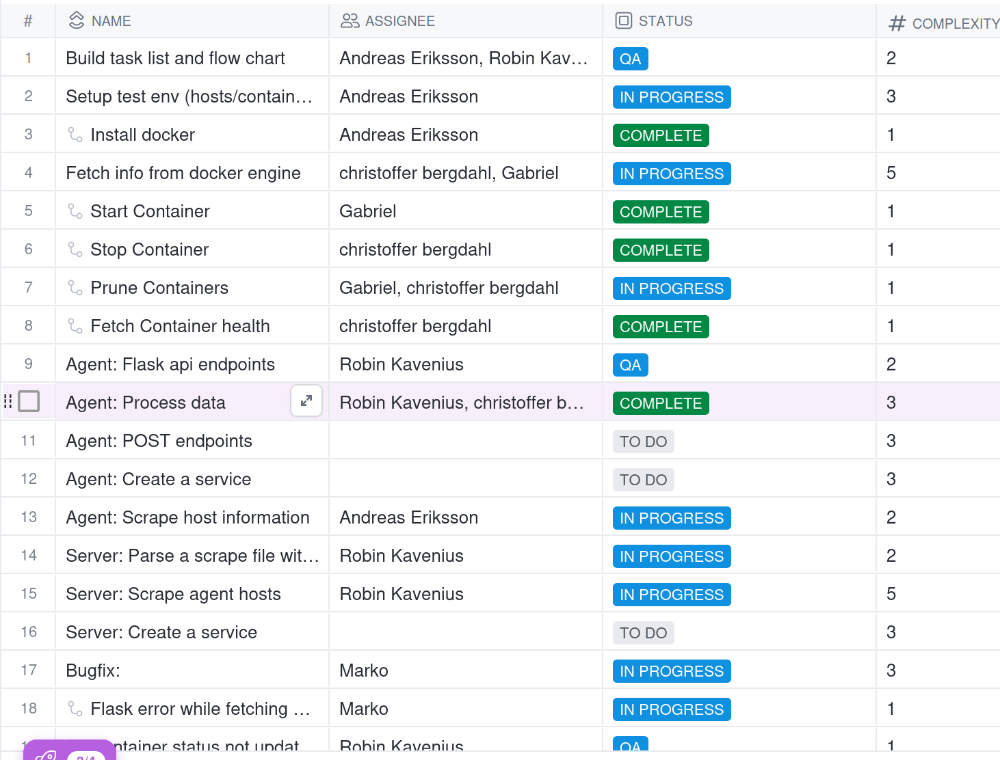

**Idag har vi...**

Implementerat den flask-baserade agenten och jobbat på buggfixar i agenten.

Aktiverat branch protection så att en merge kräver att 2 personer till godkänner merges för att ha majoritet.

Pratat om features som vi ska implementera (skapa containers från images/pruna containers.)

