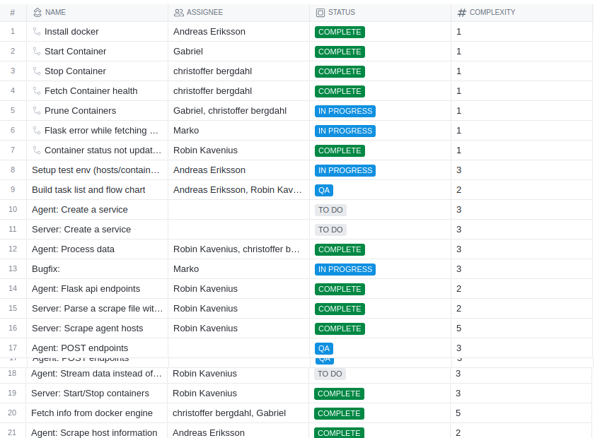

**Idag har vi...**

Formaterat container print output i CLI servern och implementerat Start/Stop för containers från den.

Fått POST metoder att fungera för att kunna utöka funktionaliteten senare.
En api endpoint för att visa images och för att starta containers från dessa.

