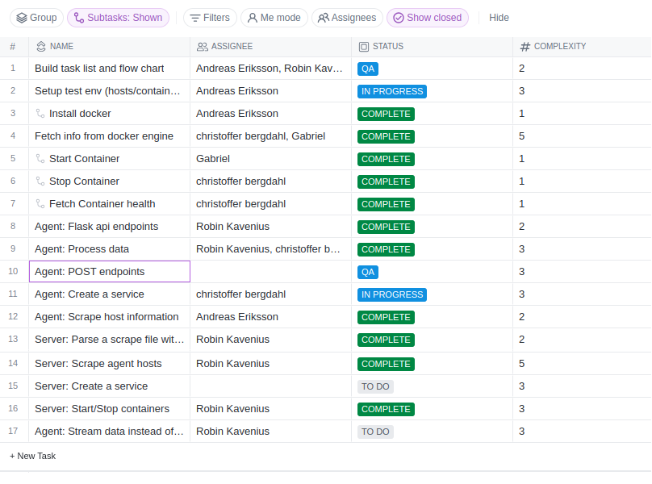

**Idag har vi...**

Mergat massa pull requests till main med förbättringar och buggfixar.
- Prune containers.
- Flask error på stoppad container.
- Multitråd för requests.
- Starta image från api endpoint.
- etc...

Börjat på en service för agenten så att den autostartar.

