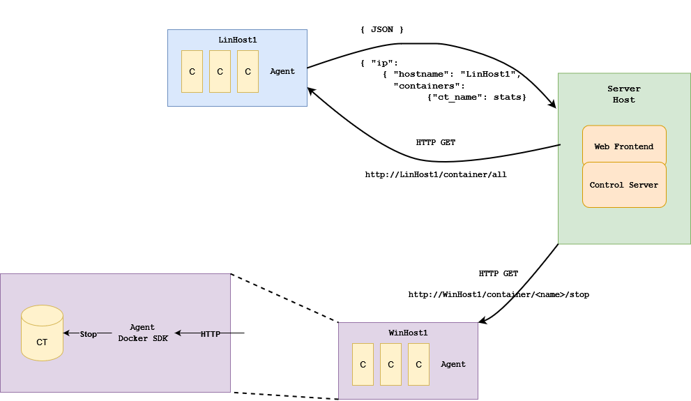
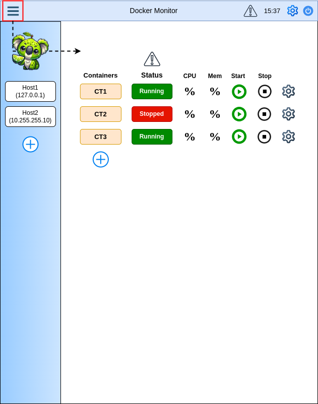

### Vision

Tillhandahålla ett webbaserat övervakningsverktyg för prestandaövervakning och administrering utav Docker-Containers på flertal servrar med ett responsivt gränssnitt som visualiserar viktiga mätvärden i realtid, vilket gör det tillgängligt för Webbadmins.

Programmering sker främst i Python. Kanske behövs powershell och bash för att hämta information från hostsen.

### Struktur

Kommunicationen mellan agent och docker engine sker med hjälp av [Docker SDK for Python](https://docker-py.readthedocs.io/en/stable/) paketet och en webserver för API endpoints med [Flask](https://flask.palletsprojects.com/en/3.0.x/).

Varje host med docker installerat har en agent som tar emot HTTP requests från en central server. Servern har ett webbaserat gränssnitt med knappar för att starta/stoppa containers.

### Frontend

