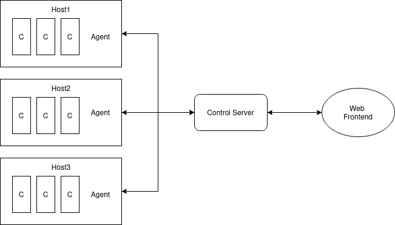

### Vision:
Tillhandahålla ett webbaserat övervakningsverktyg för prestandaövervakning
och administrering utav Docker-Container på flertal servrar
med ett responsivt gränssnitt som visualiserar viktiga mätvärden i realtid,
vilket gör det tillgängligt för Webadmins.

Varje host med docker engine installerat har också en agent som kommunicerar med en central kontrollserver. Kontrollservern har ett webbaserat gränssnitt med kontroller för att starta/stoppa containers.

Programmeing sker i Python.

Kommunicationen mellan agent och docker engine sker med hjälp av "Docker SDK for Python" paketet.

En kommunikationskanal mellan agenter och kontrollserver skapas med förslagsvis "sockets" paketet.
